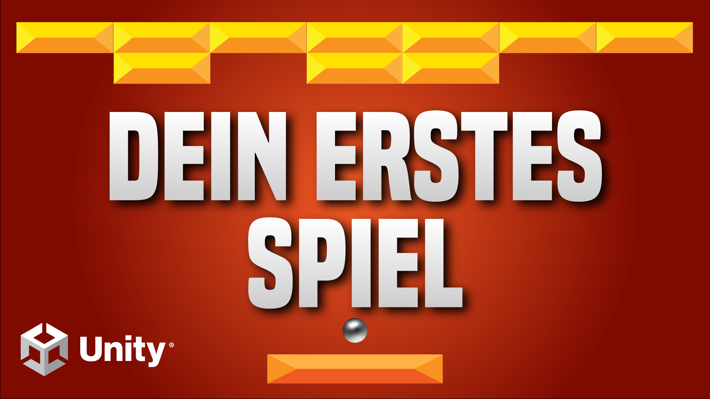

# Breakout (2D)

Lerne das klassische 2D Arcade-Spiel Breakout in Unity zu entwickeln! In diesem Spiel muss der Player alle Bricks zerstören, indem er den herumfliegenden Ball in ihre Richtung schießt. 
Diese Videoreihe richtet sich vor allem an absolute Einsteiger in der Spieleentwicklung. Es wird jeder Schritt genau erklärt!

- Schwierigkeitsgrad: Anfänger
- Themen: Physik, Kollisionen
- Version: 2020.3.26f1
- [🧰 Assets Download](https://github.com/PrezipGames/Breakout/raw/main/BreakoutPackage.unitypackage)
- [🎮 Downloade das ganze Projekt](https://github.com/PrezipGames/Breakout/archive/refs/heads/main.zip)
- [🎬 YT Tutorial](https://www.youtube.com/watch?v=MTn1LDzZnro&list=PL5ilq2JHX8N79tlLb5BinxmdcLz9ML1qJ)
- [💬 Joint unserem Discord Server](https://discord.gg/kusy4JQ4)
- [👍 Abonniert um keine Videos zu verpassen](https://www.youtube.com/@prezipgames)

## Viel Spaß bem Entwickeln!
